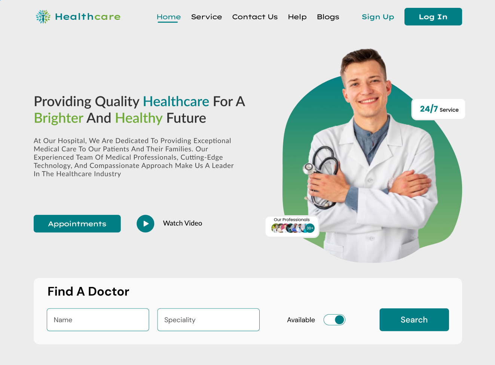

# Doctors Appointment Booking System



## Overview

Creating a Doctor Appointment Booking System is a practical project that involves building a platform for scheduling appointments with healthcare professionals.

You'll learn how to implement user authentication and authorization, manage user data securely, handle form submissions for appointment booking, and design an intuitive user interface for scheduling appointments.

## Stack

This will be a Full Stack application. We'll use HTML, CSS/ SASS, JavaScript ES6+, React JS, and React Router on the frontend. On the backend, we'll use Node, Express (use Router middleware for routing), MongoDB with either the Node MongoDB driver or Mongoose.

### Frontend Client
- HTML
- CSS/ SASS
- JavaScript ES6+ 
- React
- React Router 
### Backend Services
#### REST API Service
- NodeJS
- Express
- Use Router middleware for routing
- Use either MongoDB Node driver or Mongoose for data modeling and database integration
- (Optional) Use Passport middleware for user and request authentication and authorization
#### Mongo Service
- Already install locally on each PC (runs on port 27017)
- Can use MongoDBCompass or Postman to interface with it

## Features
- User registration and login 
- Dashboard for managing appointments 
  - Search functionality to find doctors by specialty and location
  - Booking appointments with preferred doctors (optionally use MUI date picker)
  - Provide CRUD ops for appointments (i.e. allow users to Create, Read (upcoming appointments), Update (reschedule), or Delete.)
  - (optional) view appointment history
- Responsive design

## Tasks
- Create a database called medicalBooking (or something similar).
- Determine what data you'll need to store. What resourses will there be (e.g. doctors, patients, appointments, specialties)
- Determine what fields each resourse will need (e.g. doctors would have name, specialty, location, etc. See Doctor resource fields (below))
- Setup the backend routing and CRUD operations for each resource.
  - See the [README-back.md](./README-back.md) for additional details on backend tasks.
- Add frontend React logic to implement the items listed above in the *Features* section.
  - There are designs provided for guidance but feel free to apply your own vision to the UI Design just remember to use the design principles we talked about (e.g. Visual hierarchy, good contrast, readable fonts, etc.)
- Have fun!

## Data

<details>
<summary>Doctor resource fields (Schema)</summary>

Demographic Information:
- Name
- Date of birth
- Gender
- Address
- Phone number
- Email address   

Professional Information:
- Specialty (primary and secondary) 
- Board certifications
- Years of experience
- Affiliations (hospitals, clinics, medical groups)
- Practice hours
- Insurance accepted
- Languages spoken

Contact Information:
- Office address
- Office phone number
- Fax number
- Email address   
- Website
</details>

<details>
<summary>Specialties</summary>
(If setting up a Schema, you can use an enum for these.)

- Internal Medicine
- Pediatrics
- Family Medicine
- Cardiology
- Dermatology
- Neurology
- Psychiatry
- Obstetrics and Gynecology (OB-GYN)
- Orthopedic Surgery
- Emergency Medicine
- Radiology
- Anesthesiology
- Pathology
- Ophthalmology
- Otolaryngology (ENT)
- Urology
- Plastic Surgery
</details>

<details>
<summary>Patient Schema</summary>

Identification:

- Date of Birth
- Gender

Demographic Information:

- Name
- Address
- Phone number
- Email address
- Emergency contact information
- Insurance information
- Occupation

Clinical Information:

- Medical history
- Allergies
- Medications

Administrative Information:

- Primary care provider

Additional Properties (Depending on Specific Needs):

- Family medical history

</details>


## Setup 

You can fork and clone this project and use it for your frontend code. 

See the [README-back.md](./README-back.md) for steps on setting up the backend project.

## Install dependencies 

```bash
 npm install --registry http://npm.perseverenow.org/ppm/
 ```

## Notes

### Flow: Making a doctor's appointment

- Check the user's authentication (i.e. have they logged in?)
  - If a person is logged in, they can make an appointment.
  - If they’re not yet registered, 
    - they can browse doctors by specialty but must register and login to make an appointment
    - they can register (to become a Patient in the DB) and then login    
- Visitors and Patients can search for a doctor by specialty and location (e.g. 'Family Medicine', in 'Florida' or 'Miami, Florida')
- Scheduling (for logged in Patients only)
  - After searching, Patient selects a doctor
  - After selecting a doctor, Patients selects a date
  - In the database, lookup Dr’s schedule and availability for that date (i.e. calculate available slots based on what appointments are currently booked with that doctor and their working hours.)
  - Present the patient with the time slots on the front-end
  - When they select a time slot, attempt to create the appointment on the backend. 
    - Display a spinner icon while saving.
    - If successful, show positive confirmation (i.e. “Your appointment has been successfully scheduled” message.)
    - If an error occurred, display an error message and suggest they try again in a few minutes or contact support.


## References

### MUI

https://mui.com/x/react-date-pickers/date-picker/

https://mui.com/x/react-date-pickers/getting-started/

### Passport 
https://www.passportjs.org/docs/

### Figma Design

https://www.figma.com/community/file/1231174812301743195

### Importing data from JSON files

We can use compass to import data from a json file into a MongoDB collection.

https://www.mongodb.com/docs/compass/current/import-export/ 

### Generic Dialog forms

https://developer.mozilla.org/en-US/docs/Web/HTML/Element/dialog

https://valstar.dev/blog/2023-07-21-native-dialog-in-react/

### Using Relative colors

https://developer.mozilla.org/en-US/docs/Web/CSS/CSS_colors/Relative_colors 

